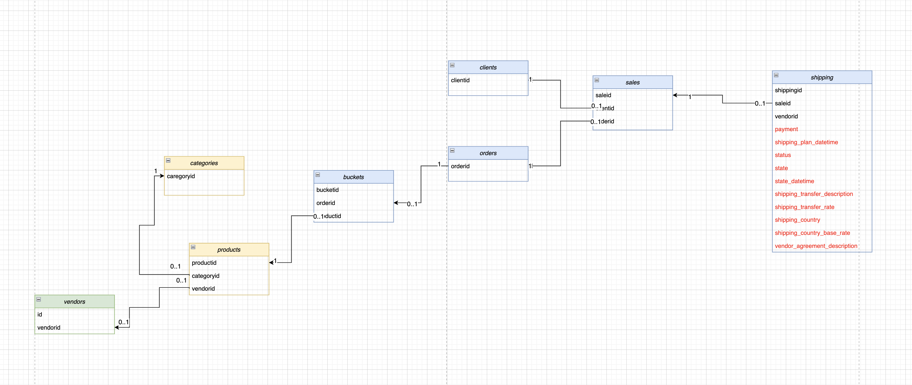

## Модификация DWH. Миграция данных в новую модель.  

| Задачи                   | Результаты |
| :-------------------- | :--------------------- |
| Мигрировать данные в отдельные логические таблицы <P><P> Создать витрину данных для новой модели данных | Реализовал миграцию данных в отдельные логические таблицы <P><P> Создал витрину данных для новой модели данных |  

<!--
## **Цели проекта**  

- Мигрировать данные в отдельные логические таблицы
- Создать витрину данных для новой модели данных

## **Используемые технологии и инструменты**
SQL  
Window Functions  
PostgreSQL  
cloudbeaver      

## **Постановка задачи**
Заказ в интернет-магазине — это набор купленных товаров и их количество. Покупатели привыкли получать заказы одномоментно, поэтому каждый заказ из набора товаров формируется в одну сущность доставки.
Интернет-магазину важно видеть, что сроки доставки соблюдаются, а её стоимость соответствует тарифам. Он платит за доставку самостоятельно, и стоимость доставки меняется в зависимости от страны — это базовая сумма, которую учитывает вендор. По договору он дополнительно получает прибыль за счет комиссии от вендора. 
Но сейчас эти данные хранятся в одной таблице, shipping, где много дублирующейся и несистематизированной справочной информации. По сути там содержится весь лог доставки от момента оформления до выдачи заказа покупателю.

Требуется сделать миграцию в отдельные логические таблицы, а затем собрать на них витрину данных. Это поможет оптимизировать нагрузку на хранилище и позволит аналитикам, перед которыми стоит задача построить анализ эффективности и прибыльности бизнеса, отвечать на точечные вопросы о тарифах вендоров, стоимости доставки в разные страны, количестве доставленных заказов за последнюю неделю. 
-->

## Реализация

Файлы `скриптов миграции` - в папке [migrations](migrations)


## Исходная схема таблиц


## Целевая схема таблиц


Создаю справочник стоимости доставки в страны shipping_country_rates из данных, указанных в shipping_country и shipping_country_base_rate, создаю первичный ключ таблицы — серийный id, то есть серийный идентификатор каждой строчки. Справочник будет состоять из уникальных пар полей из таблицы shipping.

В соответствии с новой схемой данных в новую таблицу **shipping_country_rates** переносятся поля таблицы shipping: shipping_country, shipping_country_base_rate. 

Изучаю переносимые поля shipping_country, shipping_country_base_rate
для определения типов полей в новой таблице:
```sql
SELECT cc.column_name, cc.is_nullable, cc.numeric_precision, cc.numeric_scale,   data_type
FROM  information_schema.columns cc
WHERE cc.table_schema = 'public' and  cc.table_name = 'shipping'
and cc.column_name in ('shipping_country', 'shipping_country_base_rate');
```

|column_name|is_nullable|numeric_precision|numeric_scale|data_type|
|-----------|-----------|-----------------|-------------|---------|
|shipping_country_base_rate|YES|14|3|numeric|
|shipping_country|YES|||text|


Создаю таблицу на основании полученных типов полей. Для shipping_country_id выбрал тип serial для автоматического заполнения.
```sql
drop table if exists public.shipping_country_rates;

create table public.shipping_country_rates ( 
 id serial,
 shipping_country text not null,
 shipping_country_base_rate numeric(14,3) not null,
 constraint  shipping_country_rates_p_key primary key  (id));
```

Добавил проверочное ограничение check:
```sql
alter table public.shipping_country_rates add constraint check_sh_cont_base_rate check (shipping_country_base_rate > 0 and shipping_country_base_rate < 1);
```

и заполнил справочник из уникальных пар полей из таблицы shipping
```sql
insert into public.shipping_country_rates(shipping_country, shipping_country_base_rate)
select distinct s.shipping_country, s.shipping_country_base_rate
from shipping s ;
```

Смотрю результат:
```sql
select * from public.shipping_country_rates
limit 10
```
|shipping_country_id|shipping_country|shipping_country_base_rate|
|--|----------------|--------------------------|
|1|usa|0.0200|
|2|norway|0.0400|
|3|germany|0.0100|
|4|russia|0.0300|

Добавил ограничение уникальности на наименование страны, чтобы  использовать его как ключ
```sql
alter table public.shipping_country_rates add constraint shipping_country_unique UNIQUE  (shipping_country);
```

Создаю справочник тарифов доставки вендора по договору shipping_agreement из данных строки vendor_agreement_description через разделитель :.
Названия полей:
agreementid,
agreement_number,
agreement_rate,
agreement_commission.

Agreementid делаю первичным ключом.

В соответствии с новой схемой данных в новую таблицу **shipping_agreement** переносятся следующие поля таблицы shipping: vendor_agreement_description. 

Изучаю содержимое "склеенного" поля vendor_agreement_description, чтобы понять как его разложить:
```sql
select s.id, s.shippingid, s.vendor_agreement_description from public.shipping s
limit 5
```

|id|shippingid|vendor_agreement_description|
|--|----------|----------------------------|
|1|1|0:vspn-4092:0.14:0.02|
|2|2|1:vspn-366:0.13:0.01|
|3|3|2:vspn-4148:0.01:0.01|
|4|4|3:vspn-3023:0.05:0.01|
|5|5|3:vspn-3023:0.05:0.01|


Создаю таблицу скриптом.
Задаю типы полей и обязательность исходя из видимых данных в поле vendor_agreement_description: 
```sql
drop table if exists public.shipping_agreement;

create table public.shipping_agreement ( 
 agreementid int4 not null,
 agreement_number text not null,
 agreement_rate numeric(14,4) not null,
 agreement_commission numeric(14,4) not null,
 constraint shipping_agreement_p_key primary key  (agreementid));
```

Добавляю проверочные ограничения check на числовые поля agreement_rate, agreement_commission:
```sql
alter table public.shipping_agreement add constraint check_agreement_rate check (agreement_rate > 0 and agreement_rate < 1);
alter table public.shipping_agreement add constraint check_agreement_commission check (agreement_commission > 0 and agreement_commission < 1);
```

Заполняю из уникальных комбинаций с помощью distinct, разбивая поле vendor_agreement_description на сегменты встроенной функцией regexp_split_to_array.

Поля превожу явно к требуемым типам данных.

Для тестирования преобразований типов в первых строках использую оператор приведения типов "::", а в других - оператором CAST с разными целевыми типами.

```sql
insert into public.shipping_agreement(agreementid, agreement_number, agreement_rate, agreement_commission)
select distinct 
(regexp_split_to_array(s.vendor_agreement_description, E'\\:'))[1]::int ,
(regexp_split_to_array(s.vendor_agreement_description, E'\\:'))[2]::text ,
CAST ( (regexp_split_to_array(s.vendor_agreement_description, E'\\:'))[3] AS numeric) ,
CAST ( (regexp_split_to_array(s.vendor_agreement_description, E'\\:'))[4] AS DOUBLE PRECISION)
from public.shipping s
```

Смотрю результат - для проверки те agreement_number, которые были выбраны в "предпросмотре" выше:
```sql
select * from public.shipping_agreement sa
where sa.agreement_number in ('vspn-4092', 'vspn-366', 'vspn-4148', '3:vspn-3023')
```

|agreementid|agreement_number|agreement_rate|agreement_commission|
|-----------|----------------|--------------|--------------------|
|0|vspn-4092|0.1400|0.0200|
|1|vspn-366|0.1300|0.0100|
|3|vspn-3023|0.0500|0.0100|
|2|vspn-4148|0.0100|0.0100|
|27|vspn-4148|0.1100|0.0200|

Одна строка (27) по номеру agreement_number подтянулась, которой не было выше, так как у нее тот же номер, но другой agreement_rate и agreement_commission.

Вижу, что agreement_number не уникально.

Создал справочник о типах доставки shipping_transfer из строки shipping_transfer_description через разделитель :.
Названия полей:
transfer_type,
transfer_model,
shipping_transfer_rate .
Сделал первичный ключ таблицы — серийный id.


В соответствии с новой схемой данных в новую таблицу **shipping_transfer** переносятся следующие поля таблицы shipping: shipping_transfer_description, shipping_transfer_rate.  

Изучаю содержание используемых полей shipping_transfer_description и shipping_transfer_rate
```sql
select s.shipping_transfer_description, s.shipping_transfer_rate
from public.shipping s
limit 5;
```
|shipping_transfer_description|shipping_transfer_rate|
|-----------------------------|----------------------|
|1p:train|0.025|
|1p:train|0.025|
|1p:airplane|0.040|
|1p:train|0.025|
|1p:train|0.025|

На основании видимых данных определил типы полей создаваемой таблицы shipping_transfer

```sql
drop table if exists public.shipping_transfer ;

create table public.shipping_transfer ( 
 id serial8,
 transfer_type varchar(5) not null,
 transfer_model varchar(20) not null,
 shipping_transfer_rate numeric(14,3) not null,
 constraint shipping_transfer_p_key primary key  (id));
```

Добавил проверочное ограничение check:
```sql
alter table public.shipping_transfer add constraint check_shipping_transfer_rate check (shipping_transfer_rate > 0 and shipping_transfer_rate < 1);
```

Заполнил из уникальных комбинаций с помощью distinct, разбивая поле shipping_transfer_description на сегменты встроенной функцией regexp_split_to_array.
Поля перевожу явно к требуемым типам данных.
Первичный ключ id явно не заполняю, так как он заполнится сам из последовательности благодаря указанию типа SERIAL.
Тип serial8 соответствует int8. 

Указал также:

serial = integer = int4, 

smallserial = serial2 = int2, 

bigserial = serial8 = int8.

```sql
insert into public.shipping_transfer(transfer_type, transfer_model, shipping_transfer_rate)
select distinct 
(regexp_split_to_array(s.shipping_transfer_description, E'\\:'))[1]::text ,
(regexp_split_to_array(s.shipping_transfer_description, E'\\:'))[2]::text ,
CAST ( s.shipping_transfer_rate AS DOUBLE PRECISION) 
from public.shipping s
```

Смотрю результат:
```sql
select * from public.shipping_transfer
limit 5
```

|id|transfer_type|transfer_model|shipping_transfer_rate|
|--|-------------|--------------|----------------------|
|1|3p|airplane|0.0350|
|2|1p|airplane|0.0400|
|3|1p|ship|0.0300|
|4|1p|train|0.0250|
|5|1p|multiplie|0.0500|


Создал таблицу shipping_info с уникальными доставками shippingid и связал её с созданными справочниками shipping_country_rates, shipping_agreement, shipping_transfer и константной информацией о доставке shipping_plan_datetime, payment_amount, vendorid.

В соответствии с новой схемой данных в новую таблицу **shipping_info** переносятся следующие поля таблицы shipping: shipping_plan_datetime, payment_amount, vendorid. 

Изучаю переносимые поля таблицы shipping_plan_datetime, payment_amount, vendorid
для определения типа в новой таблице:
```sql
SELECT cc.column_name, cc.is_nullable, cc.numeric_precision, cc.numeric_scale,   data_type
FROM  information_schema.columns cc
WHERE cc.table_schema = 'public' and  cc.table_name = 'shipping'
and cc.column_name in ('shipping_plan_datetime', 'payment_amount', 'vendorid');
```

|column_name|is_nullable|numeric_precision|numeric_scale|data_type|
|-----------|-----------|-----------------|-------------|---------|
|payment_amount|YES|14|2|numeric|
|shipping_plan_datetime|YES|||timestamp without time zone|
|vendorid|YES|64|0|bigint|


На основании полученных типов данных задал типы полей создаваемой таблицы shipping_info.
Уникальный ключ shippingid - типа int8, беру из shipping.
Добавил ограничения - связи типа foreign key с созданными ранее справочниками:

```sql
drop table if exists public.shipping_info ;

create table public.shipping_info ( 
 shippingid int8,
 vendorid bigint NULL,
 payment_amount numeric(14,2) NULL,
 shipping_plan_datetime timestamp NULL,
 transfer_type_id int8 not null,
 shipping_country_id int8 not null,
 agreementid int8 not null,
 constraint shipping_info_p_key primary key (shippingid));

 alter table public.shipping_info add constraint shipping_info_transfer_type_id_fkey foreign key (transfer_type_id) references shipping_transfer(id);

 alter table public.shipping_info add constraint shipping_info_shipping_country_id_fkey foreign key (shipping_country_id) references shipping_country_rates(id);

 alter table public.shipping_info add constraint shipping_agreementid_fkey foreign key (agreementid) references shipping_agreement(agreementid);
```

Добавил проверочное ограничение check:
```sql
alter table public.shipping_info add constraint check_payment_amount check (payment_amount > 0);
```

Составил запрос из shipping с группировкой для заполнения созданной таблицы:
```sql
insert into public.shipping_info(shippingid, vendorid, payment_amount, shipping_plan_datetime, transfer_type_id, shipping_country_id, agreementid)
with st as (select id as transfer_type_id, transfer_type, transfer_model
  from shipping_transfer),
  scr as (select id as shipping_country_id, shipping_country 
		 from shipping_country_rates t)
select 
	distinct s.shippingid, s.vendorid, s.payment_amount, s.shipping_plan_datetime,
	st.transfer_type_id, scr.shipping_country_id, 
	(regexp_split_to_array(s.vendor_agreement_description, E'\\:'))[1]::int
from shipping s
left join st on (regexp_split_to_array(s.shipping_transfer_description, E'\\:'))[1]::text = st.transfer_type 
	and (regexp_split_to_array(s.shipping_transfer_description, E'\\:'))[2]::text = st.transfer_model
left join scr on s.shipping_country = scr.shipping_country;
```

Вижу результат:
```sql
select * from public.shipping_info
limit 5;
```

|shippingid|vendorid|payment_amount|shipping_plan_datetime|transfer_type_id|shipping_country_id|agreementid|
|----------|--------|--------------|----------------------|----------------|-------------------|-----------|
|46123|3|1.50|2022-04-04 10:19:33.500|4|1|5|
|15790|3|4.42|2022-01-17 02:48:10.653|3|1|6|
|2818|3|1.50|2022-01-16 11:57:40.027|4|4|5|
|46405|3|14.49|2022-03-25 16:42:14.680|4|3|5|
|42345|2|6.57|2022-03-01 13:49:52.397|4|3|11|


Создал таблицу статусов о доставке shipping_status и включил туда информацию из лога shipping (status , state). Добавил вычисляемую информацию по фактическому времени доставки shipping_start_fact_datetime, shipping_end_fact_datetime. Добавил для каждого уникального shippingid его итоговое состояние доставки.

В соответствии с новой схемой данных в новую таблицу **shipping_status** переносятся следующие поля таблицы shipping: shippingid, status, state.

Изучил переносимые поля таблицы shipping для задания типов в новой таблице:
```sql
SELECT cc.column_name, cc.is_nullable, cc.numeric_precision, cc.numeric_scale,   data_type
FROM  information_schema.columns cc
WHERE cc.table_schema = 'public' and  cc.table_name = 'shipping'
and cc.column_name in ('shippingid', 'status', 'state');
```

|column_name|is_nullable|numeric_precision|numeric_scale|data_type|
|-----------|-----------|-----------------|-------------|---------|
|shippingid|YES|64|0|bigint|
|state|YES|||text|
|status|YES|||text|

На основании полученных типов данных зададал типы полей создаваемой таблицы shipping_status.
Уникальный ключ будет shippingid типа int8.

Поле shipping_end_fact_datetime может быть NULL, так как не все заказы завершены.

```sql
drop table if exists public.shipping_status ;

create table public.shipping_status ( 
 shippingid int8,
 status text NOT NULL,
 state text NOT NULL,
 shipping_start_fact_datetime timestamp NOT NULL ,
 shipping_end_fact_datetime timestamp NULL );

 alter table public.shipping_status add constraint shipping_status_p_key primary key (shippingid) ;
```

Добавил проверочное ограничение check на status и state:
```sql
alter table public.shipping_status add constraint check_status check (status in ('in_progress', 'finished'));
alter table public.shipping_status add constraint check_dates check (shipping_start_fact_datetime <= shipping_end_fact_datetime);
```

Заполнил таблицу запросом:

```sql
insert into public.shipping_status(shippingid, status, state, shipping_start_fact_datetime, shipping_end_fact_datetime)
with ts as (select s1.shippingid, 
	first_value(s1.status) over (partition by shippingid order by state_datetime desc ) last_status,
	first_value(s1.state) over (partition by shippingid order by state_datetime desc ) last_state,
	max(case when s1.state = 'booked' then s1.state_datetime end) over (partition by shippingid) start_dt,
	max(case when s1.state = 'recieved' then s1.state_datetime end) over (partition by shippingid) end_dt
	from shipping s1)
select distinct s.shippingid, ts.last_status, ts.last_state, ts.start_dt, ts.end_dt
from shipping s
left join ts on s.shippingid = ts.shippingid 
;
```

Смотрю результат:
```sql
select * from public.shipping_status
limit 5;
```

|shippingid|status|state|shipping_start_fact_datetime|shipping_end_fact_datetime|
|----------|------|-----|----------------------------|--------------------------|
|1873|finished|recieved|2021-10-18 18:29:55.541|2021-10-29 10:10:52.726|
|929|finished|recieved|2021-11-24 06:28:42.339|2021-11-27 15:29:20.020|
|17696|finished|recieved|2021-12-28 04:50:31.643|2022-01-05 00:13:23.991|
|1122|finished|recieved|2021-08-18 07:27:37.784|2021-09-05 20:41:08.091|
|3492|finished|recieved|2021-08-23 08:15:17.097|2021-08-25 13:27:53.011|

Проверил, все ли в порядке с полнотой заполнения, сгруппировав по status, state
```sql
select status, state, count(1)
from shipping_status ss
group by status, state
order by status, state
```
|status|state|count|
|------|-----|-----|
|finished|recieved|52117|
|finished|returned|810|
|in_progress|pending|1247|


Дополнительно проверил даты, разбив все строки на автоматически сгенерированных интервалах. Число интервалов беру 6.
```sql
with intvl as (select 
	date_trunc('day', (max(shipping_start_fact_datetime) - min(shipping_start_fact_datetime))/6 + interval '1 day') iv
				 from shipping_status ),
bucks as (select intvl.iv, ds from intvl, 
		   generate_series( (select min(shipping_start_fact_datetime) from shipping_status)
       			 , (select max(shipping_start_fact_datetime) from shipping_status), intvl.iv) ds)
select row_number() over (order by ds) num_bucket,
ds::date bucket_start, (ds + iv)::date bucket_end,
count(1)
from shipping_status ss, bucks
where ss.shipping_start_fact_datetime between ds and ds + iv
group by ds, iv
order by ds
```
|num_bucket|bucket_start|bucket_end|count|
|-----------|------------|----------|-----|
|1|2021-08-09|2021-09-28|8808|
|2|2021-09-28|2021-11-17|8822|
|3|2021-11-17|2022-01-06|9257|
|4|2022-01-06|2022-02-25|9794|
|5|2022-02-25|2022-04-16|9011|
|6|2022-04-16|2022-06-05|8482|

Итого 54174 - равно количеству shippingid

Создал представление shipping_datamart на основании готовых таблиц для аналитики и включил в него:
shippingid 
vendorid
transfer_type — тип доставки из таблицы shipping_transfer
full_day_at_shipping — количество полных дней, в течение которых длилась доставка. Высчитывается как:shipping_end_fact_datetime-shipping_start_fact_datetime.
is_delay — статус, показывающий просрочена ли доставка. Высчитывается как:shipping_end_fact_datetime 

shipping_plan_datetime → 1 ; 0
is_shipping_finish — статус, показывающий, что доставка завершена. Если финальный status = finished → 1; 0
delay_day_at_shipping — количество дней, на которые была просрочена доставка. Высчитыается как: shipping_end_fact_datetime  
shipping_end_plan_datetime → shipping_end_fact_datetime 
−
− shipping_plan_datetime ; 0).
payment_amount — сумма платежа пользователя
vat — итоговый налог на доставку. Высчитывается как: payment_amount * ( shipping_country_base_rate + agreement_rate + shipping_transfer_rate) .
profit — итоговый доход компании с доставки. Высчитывается как: payment_amount * agreement_commission.

 Создал итоговую витрину **shipping_datamart** как представление из таблиц shipping, shipping_status, shipping_agreement:

 Для вычисления числа полных дней использую функцию DATE_PART('day', interval).
 Таблицы соединяю через left join.

 ```sql
 create or replace view public.shipping_datamart as (
 select si.shippingid, si.vendorid, si.transfer_type_id,
 (DATE_PART('day', ss.shipping_end_fact_datetime - ss.shipping_start_fact_datetime))::int as full_day_at_shipping,
 coalesce((ss.shipping_end_fact_datetime > si.shipping_plan_datetime), false) as is_delay,
 (ss.status = 'finished') as is_shipping_finish,
 (case when ss.shipping_end_fact_datetime > si.shipping_plan_datetime then 
	DATE_PART('day', ss.shipping_end_fact_datetime - si.shipping_plan_datetime)
	end)::int as delay_day_at_shipping,
 si.payment_amount,
 si.payment_amount*(cr.shipping_country_base_rate+sa.agreement_rate+st.shipping_transfer_rate) as vat,
 si.payment_amount*agreement_commission as profit
 from public.shipping_info si
 left join public.shipping_status ss on ss.shippingid = si.shippingid
 left join public.shipping_agreement sa on sa.agreementid = si.agreementid
 left join public.shipping_country_rates cr on cr.id = si.shipping_country_id
 left join public.shipping_transfer st on st.id = si.transfer_type_id);
 ```

 Смотрю итоговый результат:
```sql
select * from public.shipping_datamart
limit 5;
```

|shippingid|vendorid|transfer_type_id|full_day_at_shipping|is_delay|is_shipping_finish|delay_day_at_shipping|payment_amount|vat|profit|
|----------|--------|----------------|--------------------|--------|------------------|---------------------|--------------|---|------|
|1|1|4|9|false|true||6.06|1.181700|0.121200|
|2|1|4|4|false|true||21.93|3.837750|0.219300|
|3|1|2|0|false|true||3.10|0.279000|0.031000|
|4|3|4|5|false|true||8.57|0.728450|0.085700|
|5|3|4|11|true|true|6|1.50|0.172500|0.015000|

 Процент задержек по поставщикам
```sql
with t as (select t1.*, count(1) over(partition by vendorid) total_cnt from shipping_datamart t1)
select  t.vendorid, t.is_delay, count(1) cnt, min(t.total_cnt) total_cnt, 
round(100*count(1)/min(t.total_cnt)::numeric,2) as perc
from  t
where t.is_delay = true
group by t.is_delay, t.vendorid
order by t.vendorid, t.is_delay
```
|vendorid|is_delay|cnt|total_cnt|perc|
|--------|--------|---|---------|----|
|1|true|551|17850|3.09|
|2|true|523|18055|2.90|
|3|true|5637|18046|31.24|
|5|true|2|35|5.71|
|6|true|2|30|6.67|
|7|true|2|41|4.88|
|15|true|1|9|11.11|
|19|true|1|18|5.56|
|21|true|3|28|10.71|

 Процент возвратов по поставщикам
```sql
with t as (select sd.vendorid,
ss.state,
count(1) over (partition by vendorid) vendor_cnt,
case when ss.state = 'returned' then 1 end ret_flag
from public.shipping_datamart sd
join shipping_status ss on ss.shippingid=sd.shippingid)
select vendorid, state, count(1) state_cnt, vendor_cnt,
round(100*count(1)/min(t.vendor_cnt)::numeric,2) as perc
from t
where state = 'returned'
group by state, vendorid, vendor_cnt
order by vendorid, state
```

|vendorid|state|state_cnt|vendor_cnt|perc|
|--------|-----|---------|----------|----|
|1|returned|267|17850|1.50|
|2|returned|258|18055|1.43|
|3|returned|267|18046|1.48|
|7|returned|3|41|7.32|
|15|returned|1|9|11.11|
|21|returned|14|28|50.00|
