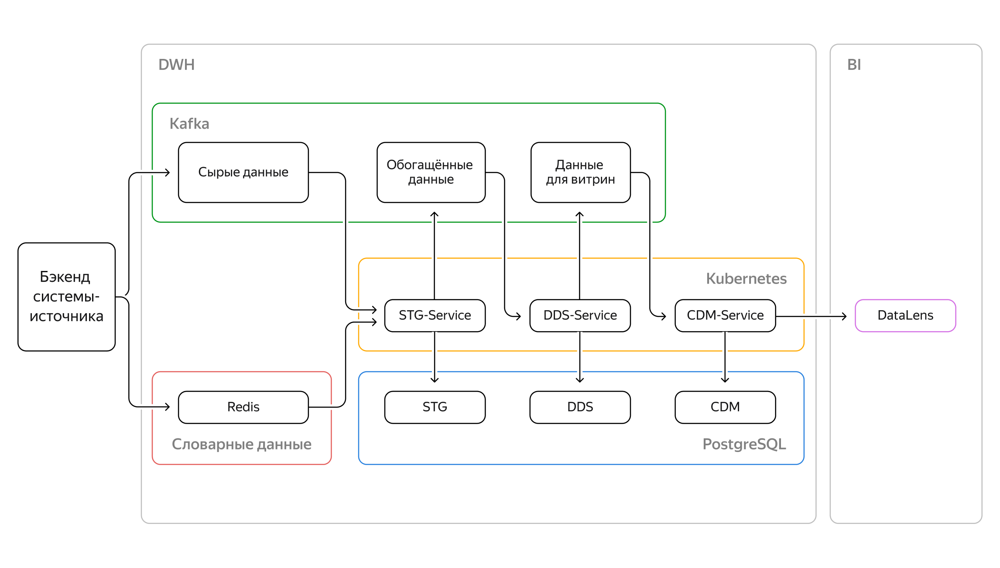
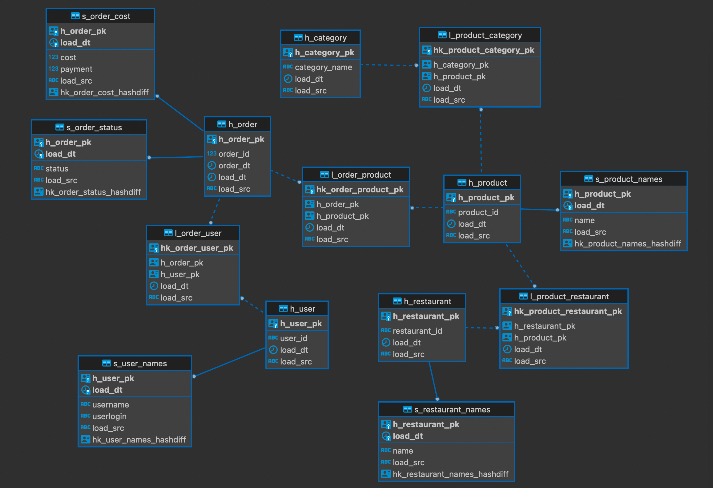

# Cloud services  

| Tasks                   | Results |
| :-------------------- | :--------------------- |
| Создать на платформе Yandex Cloud сервисы, которые реализуют ETL процесс 

 Визуализировать данные из новой витрины в дашборде в Datalense |  | 

<!--
## **Цели проекта**  

- Создать на платформе Yandex Cloud три сервиса, которые реализуют ETL процесс

- Визуализировать данные из новой витрины в дашборде в Datalense

## **Используемые технологии и инструменты**
Yandex Cloud Services  
Datalense  
Kubernetes    
kubectl  
Kafka  
kcat  
confluent_kafka  
flask  
Docker Compose  
Helm  
Redis  

## **Постановка задачи**

Целевая модель сервисов

Использую модель данных в PostgreSQL

Второй сервис является частью общей системы, которую я спроектировал ранее. Задача этого сервиса —  заполнять данными детальный слой DWH в Postgres. На вход он получает выходные данные из первого сервиса. Требуется поместить сервис в docker и затем в Kubernetes.

Задача третьего сервиса — заполнять витрины данными из потока.
Требуется поместить сервис в docker и затем в Kubernetes.

Подключить к DataLens хранилище.
В DataLens создать датасет для построения графиков на основе слоя витрин из хранилища.
Создать дашборд, который будет включать в себя такие графики: 
- круговая диаграмма, показывающая популярность категорий блюд на основе доли пользователей, которые заказывали блюда этой категории;
- круговая диаграмма, показывающая популярность категорий блюд на основе доли заказов, в которых были блюда этой категории;
- столбчатая диаграмма, показывающая популярность блюд по количеству уникальных пользователей, заказавших блюдо;
- столбчатая диаграмма, показывающая популярность блюд по количеству заказов, в которых было блюдо.

-->

## Реализация

Адреса образов, в которых реализованы сервисы  
stg:  
cr.yandex/crp2knonkmhas624g7ve/stg_service:v2023-06-10-r1  
dds:  
cr.yandex/crp2knonkmhas624g7ve/dds_service:v2023-06-10-r1  
cdm:  
cr.yandex/crp2knonkmhas624g7ve/cdm_service:v2023-06-10-r1

Ссылка на дашборд  
https://datalens.yandex/wkr29s7fdmicm  

Исходники сервиса STG, который реализован ранее, находятся в папке [sprint-9-sample-service](sprint-9-sample-service)

Исходники сервисов DDS и CDM и настройки для helm в папке [solution](solution)

Собираю образы через buildx, так как на MacOS:  
docker buildx build  --platform linux/amd64 -t cr.yandex/crp2knonkmhas624g7ve/stg_service:v2023-06-10-r1 .  
docker buildx build  --platform linux/amd64 -t cr.yandex/crp2knonkmhas624g7ve/dds_service:v2023-06-10-r1 .  
docker buildx build  --platform linux/amd64 -t cr.yandex/crp2knonkmhas624g7ve/cdm_service:v2023-06-10-r1 .  

Заливаю в облако:  
docker push cr.yandex/crp2knonkmhas624g7ve/stg_service:v2023-06-10-r1  
docker push cr.yandex/crp2knonkmhas624g7ve/dds_service:v2023-06-10-r1  
docker push cr.yandex/crp2knonkmhas624g7ve/cdm_service:v2023-06-10-r1  

Заливаю образы в Kubernetes с помощью helm:  
~/helm/helm uninstall de-project9-stg  
~/helm/helm upgrade --install --atomic de-project9-stg ../app    
~/helm/helm uninstall de-project9-dds  
~/helm/helm upgrade --install --atomic de-project9-dds ../app_dds  
~/helm/helm uninstall de-project9-cdm  
~/helm/helm upgrade --install --atomic de-project9-cdm ../app_cdm  

Смотрю логи работы в Kubernetes  
kubectl get pods  
kubectl logs -f [имя пода]  

