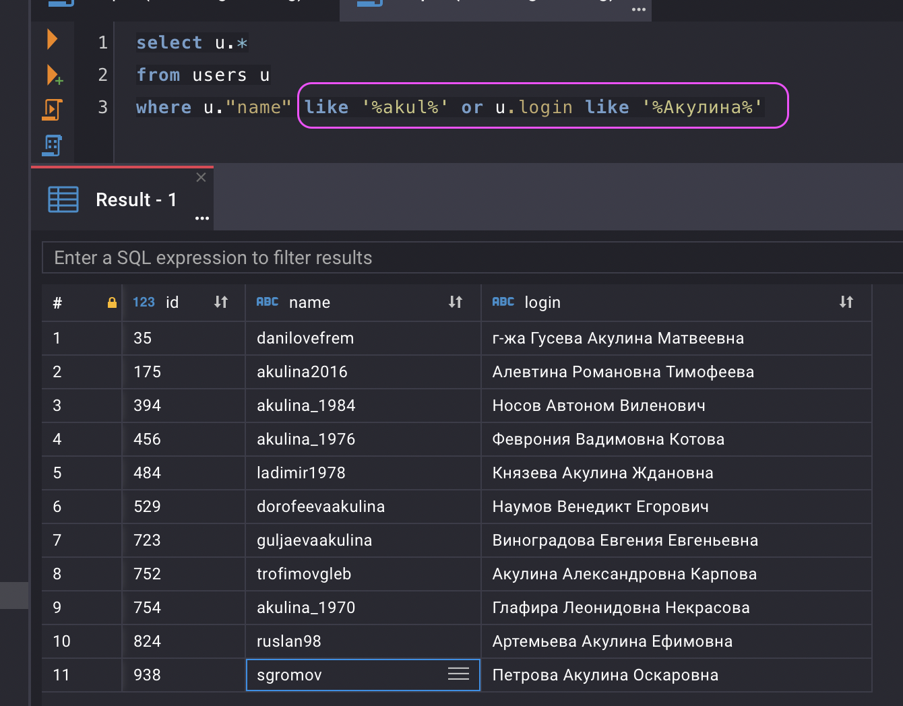

## **Цель проекта**  

- Проверить качество исходных данных (пропуски, повторы, форматы, некорректные записи)

- Составить витрину для RFM-классификации пользователей. 

## **Используемые технологии и инструменты**
SQL  
Window Functions
PostgreSQL  
cloudbeaver      

## **Постановка задачи**
Проект - часть приложения компании по доставке еды. 

**RFM** - Recency Frequency Monetary Value — сегментация клиентов в анализе сбыта по лояльности.

Показатель **RFM** определяет три группы:

- Recency (давность) — давность с момента последнего заказа.
- Frequency (частота) — количество заказов.
- Monetary Value (деньги) — сумма затрат клиента.

Каждому клиенту требуется присвоить сегмент - число от 1 до 5 - по каждому из трех измерений. При этом границы необходимо подобрать таким образом, чтобы количество клиентов в каждом сегменте было одинаковым.

Например, если в базе всего 100 клиентов, то 20 клиентов должны получить “1”, 20 клиентов должны получить “2” и т.д.

Для Frequency и Monetary Value клиенты располагаются по возрастанию. Т.е. клиенты с наименьшим количеством заказов получат “1” по шкале frequency. Аналогично, клиенты с наименьшей суммой трат получат “1” по шкале monetary value.

Шкала recency меряется по последнему заказу клиента. “1” получат те, кто не делал заказов а так же те, кто делал заказы давно. “5” получат клиенты, делавшие заказы позже остальных, т.е. относительно недавно.

## **Реализация**

# Витрина RFM

## 1.1. Требования к целевой витрине.

Постановка задачи выглядит достаточно абстрактно - постройте витрину. Первым делом необходимо выяснить у заказчика детали. Запросим недостающую информацию у заказчика в чате.

Зафиксируем выясненные требования. Составим документацию готовящейся витрины на основе заданных вопросов, добавив все необходимые детали.


1. Витрина должна располагаться в той же базе в схеме analysis
2. Витрина должна состоять из следующих полей:
- user_id
- recency (число от 1 до 5)
- frequency (число от 1 до 5)
- monetary_value (число от 1 до 5)

3. В витрине нужны данные с начала 2022 года.
4. Витрину назвать **dm_rfm_segments** 
5. Обновления витрины не требуется.

## 1.2. Изучение структуры исходных данных.

Для расчета витрины будем использовать следующие поля:

|Таблица| Поле |
|----------|---------|
|users|id|
|orders|user_id|
|orders|order_id|
|orders|payment|
|orders|status|
|orders|order_ts|
|orderstatuses|id|
|orderstatuses|key|


## 1.3. Анализ качества данных

## Таблица orderitems
Содержит позиции заказов.

Таблица содержит уникальный индекс id.
Есть уникальный индекс из полей order_id + product_id.
Все поля имеют ограничение NOT NULL.
Есть необходимые внешние ключи на таблицы
**orders**, **products**.
Есть проверки на неотрицательность полей цен и количества.
Есть логическая проверка сумм: discount <= price, discount >= 0, quantity > 0, price >= 0.

Цена должна быть строго больше нуля - проверим запросом:
```sql
select *
from orderitems 
where price=0
```
Таких строк нет.

Присутствует избыточность данных и возможные несоответствия наименований, так как содержит состав заказов с  ценами и наименованиями позиций, которые также присутствуют в таблице **products**.

Присутствует внешний ключ по product_id на таблицу **products**, соответственно можно проверить запросом:
```sql
select o.id, o.product_id, o."name", p.id, p."name", p.price
from orderitems o
left join products p on o.product_id = p.id
where (o."name" <> p."name" 
	   or o.price <> p.price 
	   or o."name" is null 
	   or o.price is null)
```
Разных и пустых значений нет.

Данная таблица для выполнения задания использоваться не будет.


## Таблица orders
Содержит данные о заказах: суммы, статус, ссылку на клиента.
Поля:
- order_id - уникальный код заказа
- order_ts - дата/время заказа (поле типа timestamp) 
- user_id - код клиента
- payment - сумма оплаты за заказ
- bonus_payment - оплата бонусами, нужно изучить, добавлять или нет к сумме payment,
- cost - общая сумма заказа?,
- bonus_grant - начисленные бонусы за заказ, нужно изучить статистику
- status - статус заказа

Содержит уникальный ключ order_id.

Все поля имеют ограничение NOT NULL.

Для полей paypment, bonus_payment, cost, bonus_grant нет ограничений на положительные значения.
Проверим их запросом:
```sql
select t.bonus_payment, t.payment, t."cost", t.bonus_grant
from orders t
where t.bonus_payment <0 or t.payment <=0 or t."cost" <=0 or t.bonus_grant <= 0
```

Есть ограничение
CONSTRAINT orders_check CHECK ((cost = (payment + bonus_payment))),
Значит cost - суммарная стоимость заказа для пользовтеля, нужно пользоватся ей.

Обратим внимание, что значения cost и payment везде одинаковые, bonus_payment везде нулевой (подтверждается, общая сумма заказа - cost), bonus_grant - везде больше нуля.

Изучим значения поля bonus_grant относительно суммы заказа:
```sql
select round(100.0*bonus_grant/cost, 1) percnt, count(1) cnt
from orders o
group by 100.0*bonus_grant/cost
```

| percnt | cnt    | 
| :---:   | :---: |
| 1.0 | 10000   |


За каждый заказ начислено 1% бонусов от стоимости заказа.

Изучим содержимое поля статуса status.
Ссылок на первичный ключ другой таблицы нет, но должна быть на справочник - таблицу **orderstatuses**.
Проверим статистику статусов следующим запросом:

```sql
select o.status order_status_id, os.id loookup_id, os."key", count(o.order_id)
from orders o
full join orderstatuses os on os.id = o.status
group by o.status, os.id, os."key"
order by o.status, os.id, os."key"
```

|order_status_id|loookup_id|key|count|
|:---------------:|:------------:|:----------|-----:|
|4|4|Closed|4991|
|5|5|Cancelled|5009|
||1|Open|0|
||2|Cooking|0|
||3|Delivering|0|

 У всех статус всех заказов согласно полю status:  "Closed" или "Cancelled".

Проверим, соответствует ли значение поля order_ts дате финального статуса заказа из таблицы **orderstatuslog**:
```sql
with t as (
  select osl.order_id,osl.status_id,
  	last_value(osl.status_id) 
  			over (partition by osl.order_id
				  order by osl.dttm asc
				 RANGE BETWEEN UNBOUNDED PRECEDING AND UNBOUNDED FOLLOWING) log_last_status_id
  from orderstatuslog osl)
select t.log_last_status_id, o.status order_status_id , count(1)
from t
left join orders o on o.order_id = t.order_id
where t.status_id = t.log_last_status_id
group by t.log_last_status_id, o.status 

```
Последний по времени статус в таблице **orderstatuslog** и в таблице **orders** совпадают.

|log_last_status_id|order_status_id|count|
|------------------|---------------|-----|
|4|4|4991|
|5|5|5009|


На первом этапе будем использовать поле status таблицы **orders** как источник информации о финальном статусе заказа.


## Таблица orderstatuses
Таблица - справочник статусов заказов, два поля: уникальный ключ id и наименование в поле key.

Содержит уникальный индекс id.

На него ссылается внешний ключ по полю status_id из таблицы **orderstatuslog**.

Все поля имеют ограничение NOT NULL.

|id|key|
|--|---|
|1|Open|
|2|Cooking|
|3|Delivering|
|4|Closed|
|5|Cancelled|

Проверим уникальность наименования - поле key, запросом
```sql
select "key", count(1)
from orderstatuses 
group by "key"
having count(1) > 1
```

Повторяющихся значений нет.

Будем использовать данную таблицу в задании.

## Таблица orderstatuslog
Таблица содержит последовательность смены статусов заказов, так как задано ограничение на уникальность (order_id, status_id), есть внешние ссылки на таблицы **orders** и **orderstatuses**.

Имеется поле даты dttm в формате timestamp.

Все поля обязательны - имеют ограничение NOT NULL.

На первом этапе данную таблицу использовать не требуется.

## Таблица products
Является справочником составляющих заказа, так как на нее ссылается внешний ключ по полю product_id из таблицы **orderitems**.

Все поля имеют ограничение NOT NULL.

Поле price имеет ограничение - только положительные значения:

CONSTRAINT products_price_check CHECK ((price >= (0)::numeric))

Проверим, есть ли составляющие с ценой = 0:
```sql
select count(1)
from products p
where p.price =0

Результат - 0 строк, такие составляющие отсутствуют.

Поле price имеет значение по умолчанию 0 (DEFAULT 0), что может привести к ошибке при заполнении.

Требуется проверить уникальность наименования - поле name, запросом
```sql
select p.name, count(1)
from products p
group by p."name"
having count(1) > 1
```

Повторяющихся значений нет.

Данную таблицу использовать в задании не требуется.

## Таблица users
Содержит список клиентов, есть уникальный индекс id. 
Всего содержит **1000** записей.

Используем это число для контроля полноты расчитываемых метрик далее в анализе.

Для полей name и login нет проверки на уникальность, проверим  уникальность запросами:

```sql
select u.login, count(1)
from users u
group by u."login"
having count(1) > 1
```
```sql
select u.name, count(1)
from users u
group by u."name"
having count(1) > 1
```

Повторяющихся значений нет.

Для поля **name** нет ограничения на NOT NULL: 

"name" varchar(2048) NULL 

Сделаем проверку на его заполненность запросом

```sql
select u."name"
from users u
where coalesce(u."name", '') = ''
```
Пустых значений нет.

На таблицу не ссылаются внешние ключи, но очевидно поле user_id из **orders** должно иметь такую ссылку для поддержки целостности.

Cделаем это запросом:
```sql
select t.user_id
from production.orders t
where t.user_id not in (select "id" from production.users)
```
Несоответствующих значений нет.

Данную таблицу будем использовать в задании.


В таблице **users** кроме отсуствия ограничений на NULL и уникальности полей name и login, имеется несогласованность значений name и login: очевидно они принадлежат разным людям.

Возможно, что таблица неполная по количеству строк, так как в таблице не находится соответствий по ФИО и логинам даже в разных строках.




Также значения name и login помещены в поля наоборот: длинное русскоязычное ФИО следует поместить в поле name, логин латинскими буквами в login.

**Это самая большая претензия к качеству данных.**


 Далее проверки требует таблица **orderitems** в части количества позиций в одном заказе и количества единиц одной позиции в заказе (поле quantity).

 Проведем эти проверки следующими запросами:

Распределение по количеству позиций в заказе:

```sql
with t as (select oi.order_id, count(1) items_in_order_cnt
from orderitems oi
group by oi.order_id) 
select items_in_order_cnt, count(1) grp_volume
from t
group by items_in_order_cnt
order by items_in_order_cnt desc
```

|items_in_order|grp_volume|
|:--------------:|----------:|
|10|80|
|9|382|
|8|969|
|7|1256|
|6|1356|
|5|1360|
|4|1201|
|3|1150|
|2|1151|
|1|1095|

Результат говорит, что заметных выбросов, отклонений нет.


Распределение по количеству единиц одной позиций:

```sql
select oi.quantity, count(1) grp_volume
from orderitems oi
group by oi.quantity
order by oi.quantity desc
``` 
|quantity|grp_volume|
|:--------:|----------:|
|19|1|
|16|2|
|15|11|
|14|18|
|13|19|
|12|51|
|11|63|
|10|332|
|9|539|
|8|808|
|7|1006|
|6|1256|
|5|9191|
|4|8789|
|3|8691|
|2|8611|
|1|7981|

Здесь также результат запроса говорит, что заметных выбросов нет.


## Следующие инструменты обеспечивают качество данных в источнике.
Данные  в формате таблицы со следующими столбцами:
- `Наименование таблицы` - наименование таблицы, объект которой рассматриваете.
- `Объект` - Здесь укажите название объекта в таблице, на который применён инструмент. Например, здесь стоит перечислить поля таблицы, индексы и т.д.
- `Инструмент` - тип инструмента: первичный ключ, ограничение или что-то ещё.
- `Для чего используется` - здесь в свободной форме опишите, что инструмент делает.


| Наименование таблицы| Объект                      | Инструмент      | Для чего используется |
| ------------------- | --------------------------- | --------------- | --------------------- |
| production.Products | id int NOT NULL PRIMARY KEY | Первичный ключ | Обеспечивает уникальность записей о продуктах |
| production.Products | "name" varchar(2048) NOT NULL |  NOT NULL | Обеспечивает обязательность наличия значения поля |
| production.Products | price numeric(19, 5) NOT NULL | NOT NULL | Обеспечивает обязательность наличия значения поля |
| production.Products | price DEFAULT 0 | DEFAULT | Обеспечивает заполнение значения по умолчанию |
| production.Products | CHECK ((price >= (0)::numeric) | Ограничение CHECK | Обеспечивает соблюдение диапазона значений |
| production.users | id int4 NOT NULL PRIMARY KEY | Первичный ключ | Обеспечивает уникальность записей о пользователях |
| production.users | login varchar(2048) NOT NULL | NOT NULL | Обеспечивает обязательность наличия значения поля |
| production.orderitems | id int4 NOT NULL PRIMARY KEY | Первичный ключ | Обеспечивает уникальность записей о позициях заказа |
| production.orderitems | id int4 NOT NULL GENERATED ALWAYS AS IDENTITY | GENERATED ALWAYS AS IDENTITY | Обеспечивает автозаполнение из последовательности |
| production.orderitems | product_id int4 NOT NULL | NOT NULL | Обеспечивает обязательность наличия значения поля |
| production.orderitems | "name" varchar(2048) NOT NULL | NOT NULL | Обеспечивает обязательность наличия значения поля |
| production.orderitems | price numeric(19, 5) NOT NULL | NOT NULL | Обеспечивает обязательность наличия значения поля |
| production.orderitems | price numeric(19, 5) DEFAULT 0 | DEFAULT | Обеспечивает заполнение значения по умолчанию |
| production.orderitems | discount numeric(19, 5) NOT NULL | NOT NULL | Обеспечивает обязательность наличия значения поля |
| production.orderitems | discount numeric(19, 5) DEFAULT 0 | DEFAULT | Обеспечивает заполнение значения по умолчанию |
| production.orderitems | quantity int4 NOT NULL | NOT NULL | Обеспечивает обязательность наличия значения поля |
| production.orderitems | CHECK (((discount >= (0)::numeric) AND (discount <= price))) | Ограничение CHECK  | Обеспечивает соблюдение диапазона значений |
| production.orderitems | UNIQUE (order_id, product_id) | Ограничение UNIQUE | Обеспечивает уникальность сочетания значений |
| production.orderitems | CHECK ((price >= (0)::numeric)) | Ограничение CHECK | Обеспечивает соблюдение диапазона значений |
| production.orderitems | CHECK ((quantity > 0)) | Ограничение CHECK  | Обеспечивает соблюдение диапазона значений |
| production.orderitems | FK (order_id) REFERENCES production.orders(order_id) | Внешний ключ | Обеспечивает ссылочную целостность данных |
| production.orderitems | FK (product_id) REFERENCES production.products(id) | Внешний ключ | Обеспечивает ссылочную целостность данных |
| production.orders | order_id int NOT NULL PRIMARY KEY | Первичный ключ | Обеспечивает уникальность записей о продуктах |
| production.orders | user_id int4 NOT NULL | NOT NULL | Обеспечивает обязательность наличия значения поля |
| production.orders | bonus_payment numeric(19, 5) NOT NULL | NOT NULL | Обеспечивает обязательность наличия значения поля|
| production.orders | bonus_payment numeric(19, 5) DEFAULT 0 | DEFAULT | Обеспечивает заполнение значения по умолчанию |
| production.orders | payment numeric(19, 5) NOT NULL | NOT NULL | Обеспечивает обязательность наличия значения поля |
| production.orders | payment numeric(19, 5) DEFAULT 0 | DEFAULT | Обеспечивает обязательность наличия значения поля |
| production.orders | "cost" numeric(19, 5) NOT NULL  | NOT NULL  | Обеспечивает обязательность наличия значения поля |
| production.orders | "cost" numeric(19, 5) DEFAULT 0 | DEFAULT | Обеспечивает обязательность наличия значения поля |
| production.orders | bonus_grant numeric(19, 5) NOT NULL | NOT NULL  | Обеспечивает обязательность наличия значения поля |
| production.orders | bonus_grant numeric(19, 5) DEFAULT 0 | DEFAULT | Обеспечивает обязательность наличия значения поля |
| production.orders | status int4 NOT NULL | NOT NULL  | Обеспечивает обязательность наличия значения поля |
| production.orders | CHECK ((cost = (payment + bonus_payment))) | Ограничение CHECK | Обеспечивает соблюдение диапазона значений |
| production.orderstatuses | id int4 NOT NULL PRIMARY KEY | Первичный ключ | Обеспечивает уникальность записей о статусах заказа |
| production.orderstatuses | "key" varchar(255) NOT NULL | NOT NULL  | Обеспечивает обязательность наличия значения поля |
| production.orderstatuslog | id int4 NOT NULL PRIMARY KEY | Первичный ключ | Обеспечивает уникальность записей о статусах заказа |
| production.orderstatuslog | id int4 NOT NULL | NOT NULL | Обеспечивает обязательность наличия значения поля |
| production.orderstatuslog | id int4 NOT NULL GENERATED ALWAYS AS IDENTITY | GENERATED ALWAYS AS IDENTITY | Обеспечивает автозаполнение из последовательности |
| production.orderstatuslog | status_id int4 NOT NULL | NOT NULL | Обеспечивает обязательность наличия значения поля |
| production.orderstatuslog | dttm timestamp NOT NULL | NOT NULL  | Обеспечивает обязательность наличия значения поля |
| production.orderstatuslog | UNIQUE (order_id, status_id) | Ограничение UNIQUE | Обеспечивает уникальность сочетания значений |
| production.orderstatuslog | FK (order_id) REFERENCES production.orders(order_id) | Внешний ключ | Обеспечивает ссылочную целостность данных |
| production.orderstatuslog | FK (status_id) REFERENCES production.orderstatuses(id) | Внешний ключ | Обеспечивает ссылочную целостность данных |


## 1.4. Подготовка витрины данных

Теперь, когда требования понятны, а исходные данные изучены, можно приступить к реализации.

### 1.4.1. Сделаем VIEW для таблиц из базы production.

При расчете витрины просят обращаться только к объектам из схемы analysis. Чтобы не дублировать данные (данные находятся в этой же базе), нужно сделать view. Таким образом, View будут находиться в схеме analysis и вычитывать данные из схемы production. 

Напишем SQL-запросы для создания пяти VIEW (по одному на каждую таблицу).

Создаем view в схеме analysis для пяти таблиц из схемы production
```SQL
drop view if exists analysis.orderitems ;
drop view if exists analysis.orders ;
drop view if exists analysis.orderstatuses ;
drop view if exists analysis.products ;
drop view if exists analysis.users ;
create view analysis.orderitems as (select * from production.orderitems);
create view analysis.orders as (select * from production.orders);
create view analysis.orderstatuses as (select * from production.orderstatuses);
create view analysis.products as (select * from production.products);
create view analysis.users as (select * from production.users);
 
```

### 1.4.2.  DDL-запрос для создания витрины.

Далее необходимо создать витрину. Напишем CREATE TABLE запрос и выполним его на предоставленной базе данных в схеме analysis.

Создадим витрину данных dm_rfm_segments с требуемыми колонками и ограничениями на них:
- user_id
- recency (число от 1 до 5)
- frequency (число от 1 до 5)
- monetary_value (число от 1 до 5)
```SQL
drop table if exists analysis.dm_rfm_segments ;
CREATE TABLE analysis.dm_rfm_segments (
	user_id int4 NOT NULL,
 	recency int2 NOT NULL,
	frequency int2 NOT NULL,
	monetary_value int4 NOT NULL,
	CONSTRAINT dm_rfm_segments_pkey PRIMARY KEY (user_id),
	CONSTRAINT dm_rfm_segments_recency_check CHECK (recency >= 1 AND recency <= 5),
  	CONSTRAINT dm_rfm_segments_frequency_check CHECK (frequency >= 1 AND frequency <= 5),
  	CONSTRAINT dm_rfm_segments_monetary_value_check CHECK (monetary_value >= 1 AND monetary_value <= 5)
);

  ALTER TABLE analysis.dm_rfm_segments ADD CONSTRAINT dm_rfm_segments_user_id_fkey FOREIGN KEY (user_id) REFERENCES production.users(id);
```

### 1.4.3. SQL запрос для заполнения витрины

Реализуем расчет витрины на языке SQL и заполним таблицу, созданную в предыдущем пункте.

Создадим три вспомогательные таблицы для упрощения группировки
```SQL

CREATE TABLE analysis.tmp_rfm_recency (
 user_id INT NOT NULL PRIMARY KEY,
 recency INT NOT NULL CHECK(recency >= 1 AND recency <= 5)
);
CREATE TABLE analysis.tmp_rfm_frequency (
 user_id INT NOT NULL PRIMARY KEY,
 frequency INT NOT NULL CHECK(frequency >= 1 AND frequency <= 5)
);
CREATE TABLE analysis.tmp_rfm_monetary_value (
 user_id INT NOT NULL PRIMARY KEY,
 monetary_value INT NOT NULL CHECK(monetary_value >= 1 AND monetary_value <= 5)
);
```

И три запроса для заполнения созданных вспомогательных таблиц

```SQL
delete from analysis.tmp_rfm_recency ;

with t as (select u.id as user_id, 
	max(case when oss."key" = 'Closed' then order_ts end) max_dttm
	, sum(case when oss."key" = 'Closed' then o.payment end) order_payment
	, sum(case when oss."key" = 'Closed' then 1 else 0 end) order_count
from analysis.users u 
left join analysis.orders o on u.id = o.user_id
left join analysis.orderstatuses oss on oss.id = o.status
group by u.id),
t2 as (select user_id, max_dttm, ntile(5) over (order by coalesce(max_dttm, '01/01/1990'::timestamp) asc) tile
			from t)
insert into analysis.tmp_rfm_recency(
select --
  user_id, tile
from t2)
```

```SQL
delete from analysis.tmp_rfm_frequency ;

with t as (select u.id as user_id, 
	max(case when oss."key" = 'Closed' then order_ts end) max_dttm
	, sum(case when oss."key" = 'Closed' then o.payment end) order_payment
	, sum(case when oss."key" = 'Closed' then 1 else 0 end) order_count
from analysis.users u 
left join analysis.orders o on u.id = o.user_id
left join analysis.orderstatuses oss on oss.id = o.status
group by u.id),
t2 as (select user_id, order_count, ntile(5) over (order by order_count asc) tile
			from t)
insert into analysis.tmp_rfm_frequency(
select user_id, tile
from t2
)
```

```SQL
delete from analysis.tmp_rfm_monetary_value ;

with t as (select u.id as user_id, 
	max(case when oss."key" = 'Closed' then order_ts end) max_dttm
	, sum(case when oss."key" = 'Closed' then o.payment end) order_payment
	, sum(case when oss."key" = 'Closed' then 1 else 0 end) order_count
from analysis.users u 
left join analysis.orders o on u.id = o.user_id
left join analysis.orderstatuses oss on oss.id = o.status
group by u.id),
t2 as (select user_id, order_payment, ntile(5) over (order by order_payment asc) tile
			from t)
insert into analysis.tmp_rfm_monetary_value(
select user_id, tile
from t2
)
```

Финальный запрос для заполнения витрины данных

```sql
delete from analysis.dm_rfm_segments;

insert into analysis.dm_rfm_segments(user_id, recency, frequency, monetary_value)

(select user_id, max(recency), max(frequency), max(monetary_value) from (
select t.user_id, t.recency, 0::int2 as frequency, 0::int2 as monetary_value
from analysis.tmp_rfm_recency  t
union all
select trf.user_id, 0, trf.frequency, 0
from analysis.tmp_rfm_frequency trf
union all
select trmv.user_id, 0, 0, trmv.monetary_value
from analysis.tmp_rfm_monetary_value trmv
) t
group by user_id);
```

----
`Первые десять строк из полученной таблицы, отсортированные по user_id с минимальными user_id.`
|user_id|recency|frequency|monetary_value|
|----------|---------|---------|---------|
|0|1|3|4|
|1|4|3|3|
|2|2|3|5|
|3|2|4|3|
|4|4|3|3|
|5|5|5|5|
|6|1|3|5|
|7|4|3|2|
|8|1|1|3|
|9|1|2|2|
