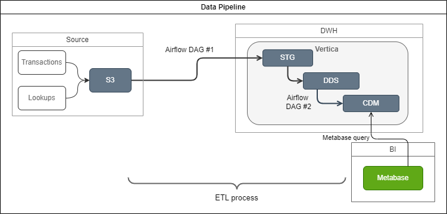
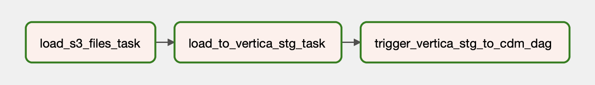
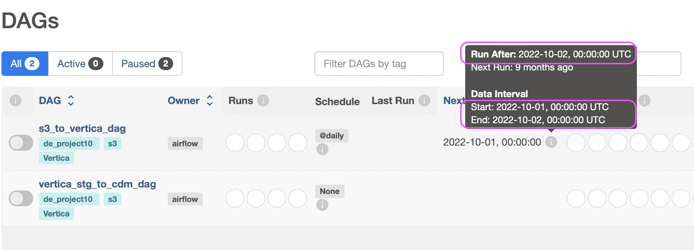
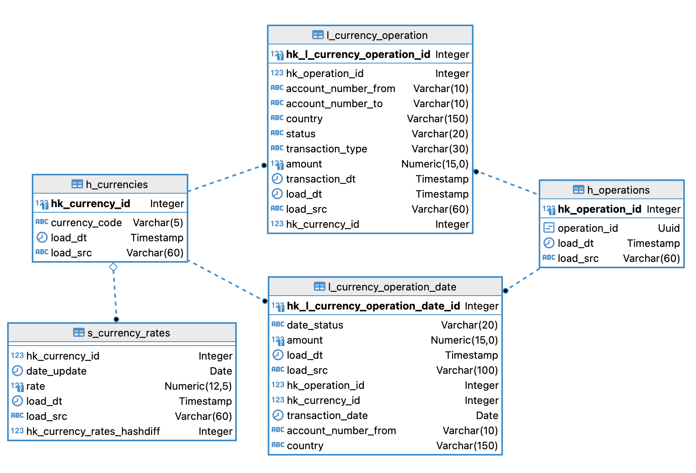
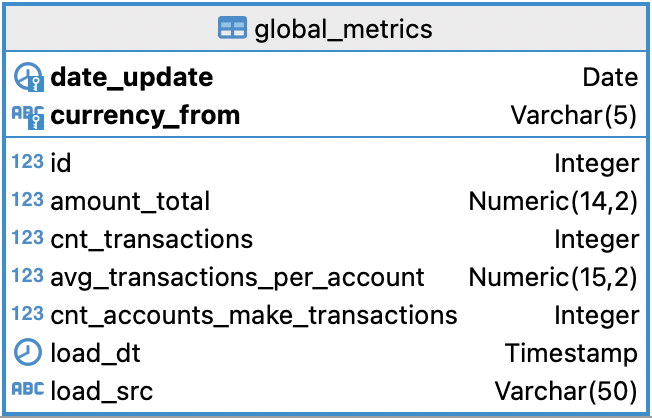
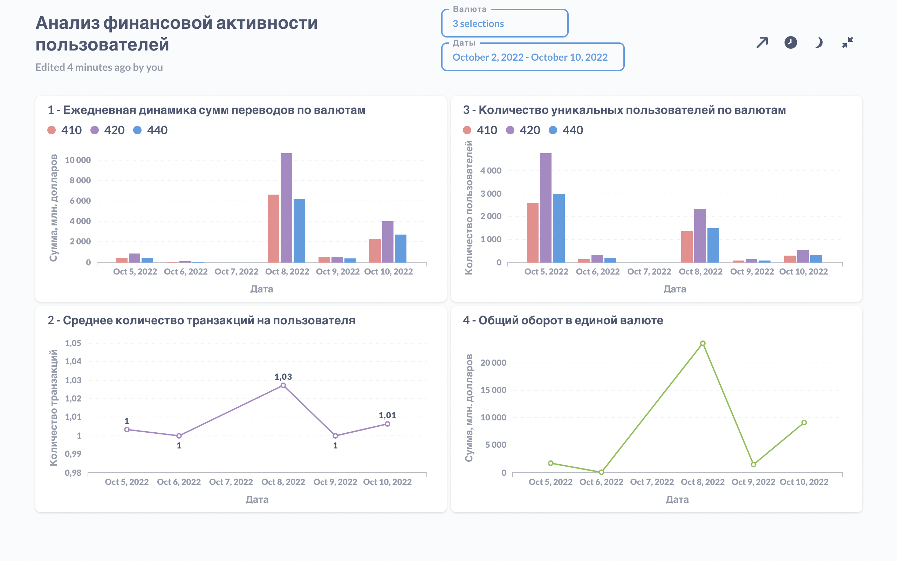

## **Цели проекта**  

Для финтех-компании, предлагающей международные банковские услуги, объединить из разных источников информацию о финансовой активность пользователей.  
Подготовить информацию для аналитиков в дашборде. 

## **Используемые технологии и инструменты**
Yandex S3 Storage  
Metabase  
Vertica  
vertica_python  
boto3  
Airflow  

## **Постановка задачи**

- Создать таблицы необходимой структуры для хранилища в слоях STG, DDS, CDM 
- Создать пайплайн загрузки данных из систем-источников в STG-слой
- Создать пайплайн автоматизированного обновления витрины данных, обеспечивающий ежедневное инкрементальное добавление данных по дате за вчерашний день
- Подключить инструмент визуальной аналитики Metabase к витрине и реализовать интерактивный отчёт для аналитиков, включающий метрики:
    - суммы переводов с возможностью смотреть общую сумму и выбирать отдельные валюты через фильтр.
    - среднего объема транзакций на пользователя.
    - количества уникальных пользователей, которые совершают транзакции в валютах.
    - общего оборота компании в единой валюте.
- Создать в дашборде фильтры по дате и выбранным валютам перевода.

## **Реализация**

Выбрана следующа схема выгрузки данных из хранилища S3 и загрузки в Vertica с помощью DAG AirFlow.



Используются пакеты `boto3`, `vertica_python`.

Первый DAG [s3_to_vertica_dag.py](src/dags/s3_to_vertica_dag.py) выгружает файлы из S3, фильтрует ранее загруженные, записывает данные в слой STG в Vertica и запускает второй DAG с помощью TriggerDagRunOperator, передавая ему дату {{ ds }} из AirFlow. 



Второй DAG [vertica_stg_to_cdm_dag.py](src/dags/vertica_stg_to_cdm_dag.py) настроен на запуск в 00:00 на обработку данных за каждый прошедший день за требуемый диапазон дат:  



```python
dag = DAG('s3_to_vertica_dag',
    default_args=args,
    schedule_interval='@daily',  
    start_date=pendulum.datetime(2022, 10, 1),  
    end_date=pendulum.datetime(2022, 11, 1),  
    catchup=True,  # Обработать предыдущие периоды
```

Он запускается по триггеру из первого и переносит данные из STG в DDS и CDM.

В слое DDS применена архитектура Data Vault


В [/src/sql](/src/sql/) - SQL-запросы формирования таблиц, проекций таблиц, а также скрипт подготовки данных для итоговой витрины.

Схема итоговой витрины данных


Дашборд для аналитиков в Metabase с необходимыми метриками и фильтрами по валюте и дате.


