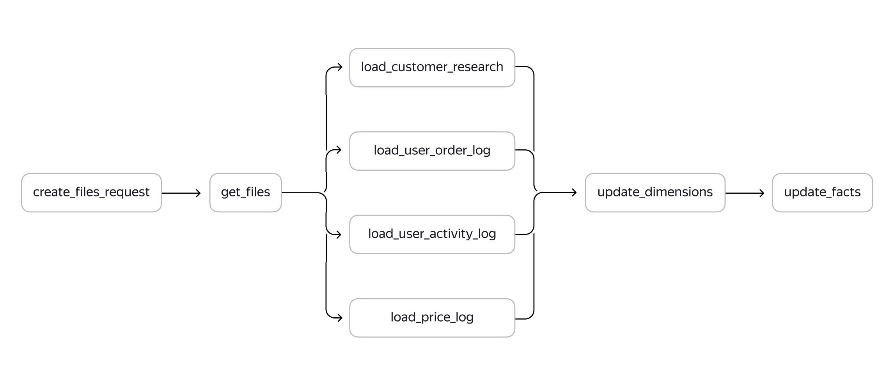

## **Цели проекта**  

- Определить, на каких этапах ETL процесса внедрить проверки качества данных
- Разработать и внедрить проверки в ETL процесс 
- Создать витрину данных с результатами проверок 
- Составить инструкции по поддержке процессов с проверками

## **Используемые технологии и инструменты**
AirFlow      
SQL  
PostgreSQL
pandas

## **Постановка задачи**

Требования проверок от постановщиков:

1. Все поступающие типы файлов должны быть названы по шаблону ddmmyyyy_tablename.csv. Такая проверка поможет убедиться в наличии нужных файлов. Она критичная — если каких-то файлов не окажется, загрузка должна остановиться.

2. Поле customer_id в таблицах user_order_log и user_activity_log не должно иметь значение NULL. Некритичная проверка — при наличии записей со значением NULL загрузка продолжится.

3. Число клиентов в файлах user_order_log и user_activity_log должно быть больше трёх. Ещё одна критичная проверка — при обнаружении в файлах трёх и менее клиентов загрузка остановится.

## **Реализация**

Исходный DAG

Лучшее место на схеме для первой проверки — после шага get_files, а для второй и третьей проверок — после шагов load_user_order_log и load_user_activity_log.

