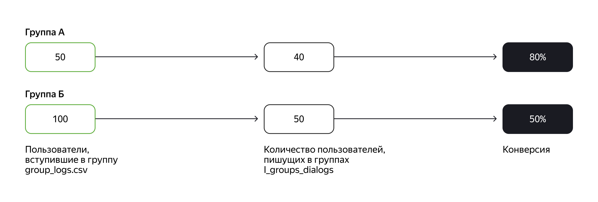
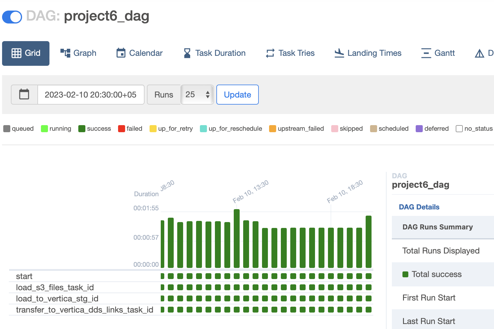
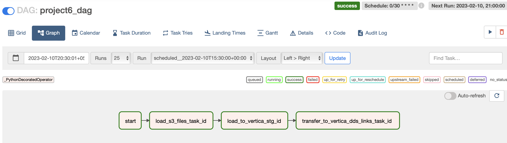
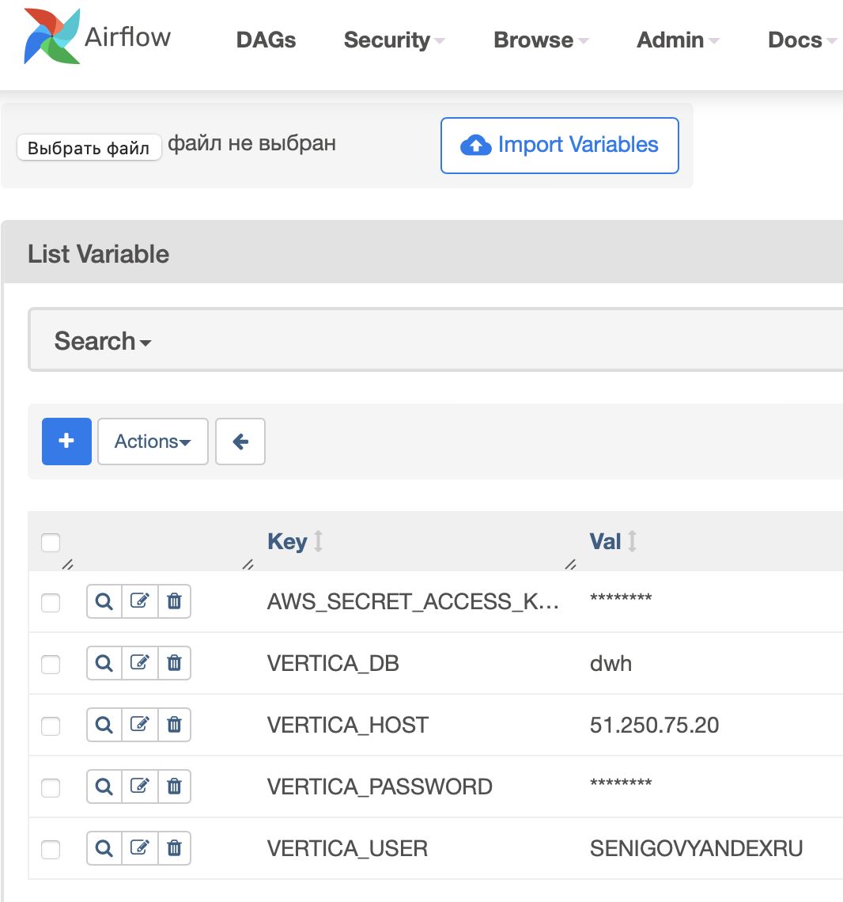
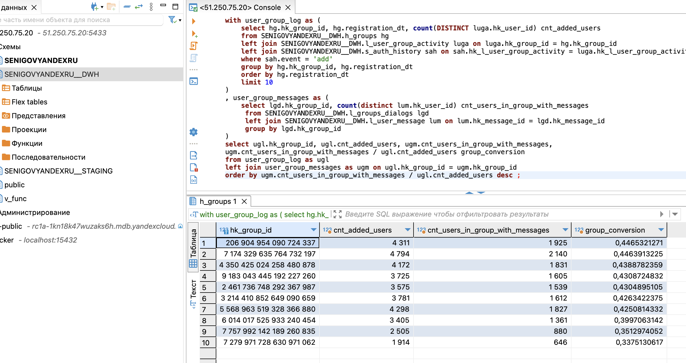

## **Цели проекта**  

- Расширить модель данных в аналитической БД
- Разработать витрину данных для оценки эффективности рекламы

## **Используемые технологии и инструменты**
AirFlow      
Yandex S3 Storage
CTL
SQL  
Vertica
cloudbeaver  
pendulum  
boto3  
vertica_python  
pandas  

## **Постановка задачи**

Маркетологи хотят разместить на сторонних сайтах рекламу сообществ с высокой активностью. Требуется определить группы, в которых начала общаться большая часть их участников, то есть с высокой конверсией в первое сообщение.

На схеме ниже видно, что в группе А конверсия выше, чем в Б. Хотя в группе А сейчас общается только 40 пользователей соцсети, а в Б — 50, доля активных в А выше, ведь в ней всего 50 человек. В то время как в группе Б сообщения написали уже 50 участников, но это лишь половина от общего количества — 100. Значит, если в обе группы вступит одинаковое число людей, эффективнее сработает сообщество А, потому что оно лучше вовлекает своих участников. Получается, что для рекламы соцсети стоит выбрать группу А и другие паблики с высокой конверсией. 



Требуется выявить и перечислить маркетологам такие сообщества.

Декомпозиция задачи:
1. Перенести из S3 в staging-слой новые данные о входе и выходе пользователей из групп — файл group_log.csv.
Лог работы групп group_log.csv содержит:
group_id — уникальный идентификатор группы  
user_id — уникальный идентификатор пользователя  
user_id_from — поле для отметки о том, что пользователь не сам вступил в группу, а его добавил другой участник. Если пользователя пригласил в группу кто-то другой, поле будет непустым.  
event — действие, которое совершено пользователем user_id. Возможны следующие варианты:  
create — пользователь создал группу  
add — пользователь user_id вступил сам или был добавлен в группу  
leave — пользователь user_id покинул группу  
datetime — время совершения event  
2. Создать в слое постоянного хранения таблицы для новых данных.
3. Перенести новые данные из staging-области в слой DDS.
4. Рассчитать конверсионные показатели для десяти самых старых групп: 
- количество пользователей, вступивших в группу, — cnt_added_users;
- количество участников группы, которые написали хотя бы одно сообщение, — cnt_users_in_group_with_messages;
- конверсию в первое сообщение из вступления в группу — group_conversion.


## **Реализация**


Шаг 1. Загрузить данные из S3
--- 
Для загрузки данных из S3 создал DAG в Airflow.

 
---  

---  

---  
В нем идет подключение к бакету sprint6 в S3 и выгрузка файла group_log.csv в папку data.
   
[src/dags/project6_dag.py](src/dags/project6_dag.py)  

Код в task `load_s3_files_task_id`
```sql
    @task(task_id="load_s3_files_task_id") 
    def load_s3_files_task():
        logging.info ('Start load from S3')

        AWS_ACCESS_KEY_ID = "YCAXXXXX"
        AWS_SECRET_ACCESS_KEY = Variable.get("AWS_SECRET_ACCESS_KEY")

        session = boto3.session.Session()
        s3_client = session.client(
            service_name='s3',
            endpoint_url='https://storage.yandexcloud.net',
            aws_access_key_id=AWS_ACCESS_KEY_ID,
            aws_secret_access_key=AWS_SECRET_ACCESS_KEY,
        )

        for file_name in bucket_files_list:
            logging.info('Downloading ' + file_name)

            s3_client.download_file(
                Bucket='sprint6',
                Key=file_name,
                Filename='/data/' + file_name
        )
```
  
Шаг 2. Создать таблицу group_log в Vertica
---  
Создал таблицу `group_log` в схеме _STAGING с учётом формата данных в скачанном файле.
Создал внешние ключи на существующие в _STAGING таблицы.

[src/sql/create_tables.sql](src/sql/create_tables.sql)  

```sql
drop table if exists SENIGOVYANDEXRU__STAGING.group_log;

create table SENIGOVYANDEXRU__STAGING.group_log
(
    group_id   integer ,
    user_id   integer ,
    user_id_from integer ,
    event varchar(10) ,
    event_datetime timestamp
)
order by group_id, user_id
SEGMENTED BY hash(group_id) all nodes
PARTITION BY event_datetime::date
GROUP BY calendar_hierarchy_day(event_datetime::date, 3, 2) 
;

ALTER TABLE SENIGOVYANDEXRU__STAGING.group_log ADD CONSTRAINT fk_group_log_groups_group_id FOREIGN KEY (group_id) references SENIGOVYANDEXRU__STAGING.groups (id);
ALTER TABLE SENIGOVYANDEXRU__STAGING.group_log ADD CONSTRAINT fk_group_log_users_user_id_from FOREIGN KEY (user_id) references SENIGOVYANDEXRU__STAGING.users (id);
ALTER TABLE SENIGOVYANDEXRU__STAGING.group_log ADD CONSTRAINT fk_group_log_users_user_id FOREIGN KEY (user_id_from) references SENIGOVYANDEXRU__STAGING.users (id);

```

Шаг 3. Загрузить данные в Vertica
---  

В DAG добавил задачу, в которой считываю из папки data файл group_log.csv и загружаю его в созданную таблицу `group_log` в схеме __STAGING с помощью библиотеки vertica_python функцией `COPY file_name FROM LOCAL`.  

[src/dags/project6_dag.py](src/dags/project6_dag.py)  
  
Код в task `load_to_vertica_stg_id`
```sql
    @task(task_id="load_to_vertica_stg_id")
    def load_to_vertica_stg_task():
        logging.info('Start load to Vertica STG')

        conn_info = {'host': Variable.get("VERTICA_HOST"), # Адрес сервера 
             'port': '5433', # Порт из инструкции,
             'user': Variable.get("VERTICA_USER"), # Полученный логин
             'password': Variable.get("VERTICA_PASSWORD"),
             'database': Variable.get("VERTICA_DB"),
             'autocommit': True
            }

        with vertica_python.connect(**conn_info) as connection:
            cur = connection.cursor()

            cur.execute("truncate table SENIGOVYANDEXRU__STAGING.group_log")

            exec = cur.execute("COPY SENIGOVYANDEXRU__STAGING.group_log(group_id, user_id, user_id_from, event, event_datetime) "
                        " FROM LOCAL '/data/group_log.csv' "
                        " DELIMITER ','"
                        " skip 1"
                        " REJECTED DATA AS TABLE SENIGOVYANDEXRU__STAGING.group_log_rej",
                        buffer_size=65536
            )
            r = cur.fetchall()
            logging.info("Rows loaded to group_log:" + str(r))
```

Шаг 4. Создать таблицу связи
---  
Создал в схеме __DWH таблицу связи `l_user_group_activity`
Создал внешние ключи на существующие в _DWH таблицы.

[src/sql/create_tables.sql](src/sql/create_tables.sql)  

```sql
drop table if exists SENIGOVYANDEXRU__DWH.l_user_group_activity ;

create table SENIGOVYANDEXRU__DWH.l_user_group_activity
(
   hk_l_user_group_activity integer PRIMARY KEY,
   hk_user_id int not null,
   hk_group_id int not null,
   load_dt timestamp not null,
   load_src VARCHAR(20)
);

ALTER TABLE SENIGOVYANDEXRU__DWH.l_user_group_activity ADD CONSTRAINT fk_uga_users_hk_user_id FOREIGN KEY (hk_user_id) references SENIGOVYANDEXRU__DWH.h_users(hk_user_id);
ALTER TABLE SENIGOVYANDEXRU__DWH.l_user_group_activity ADD CONSTRAINT fk_uga_groups_hk_group_id FOREIGN KEY (hk_group_id) references SENIGOVYANDEXRU__DWH.h_groups(hk_group_id);
```

Шаг 5. Создать скрипты миграции в таблицу связи
---  
Составил SQL-скрипт миграции данных из `_STAGING.group_log` в созданную таблицу-линк `l_user_group_activity`.
Скрипт вызывается в DAG.  

[src/dags/project6_dag.py](src/dags/project6_dag.py) 

Код в task `transfer_to_vertica_dds_links_task_id`
```sql
    @task(task_id="transfer_to_vertica_dds_links_task_id")
    def transfer_to_vertica_dds_links_task():
        logging.info('Start transfer to Vertica DDS links')

        conn_info = {'host': Variable.get("VERTICA_HOST"), # Адрес сервера 
             'port': '5433', # Порт из инструкции,
             'user': Variable.get("VERTICA_USER"), # Полученный логин
             'password': Variable.get("VERTICA_PASSWORD"),
             'database': Variable.get("VERTICA_DB"),
             'autocommit': True
            }

        with vertica_python.connect(**conn_info) as connection:
            cur = connection.cursor()

            cur.execute(
              " INSERT INTO SENIGOVYANDEXRU__DWH.l_user_group_activity(" 
              "     hk_l_user_group_activity, hk_user_id, hk_group_id, load_dt,load_src) "
              "  select distinct "
              "    hash(hk_user_id, hk_group_id) as hk_l_user_group_activity, "
              "    hk_user_id, "
              "    hk_group_id, "
              "    now() as load_dt, "
              "    's3' as load_src "
              " from SENIGOVYANDEXRU__STAGING.group_log as sgl "
              " left join SENIGOVYANDEXRU__DWH.h_users hu on hu.user_id = sgl.user_id "
              " left join SENIGOVYANDEXRU__DWH.h_groups hg on hg.group_id = sgl.group_id "
              " where hash(hk_user_id, hk_group_id) not in (select hk_l_user_group_activity from SENIGOVYANDEXRU__DWH.l_user_group_activity); "
              " ; " 
            ) 
            r = cur.fetchall()
            print("Rows loaded from STG group_log to DWH l_user_group_activity:", r)
```

Шаг 6. Создать и наполнить сателлит
---  
Создал в схеме _DWH сателлит `s_auth_history` 

[src/sql/create_tables.sql](src/sql/create_tables.sql)  

```sql
drop table if exists SENIGOVYANDEXRU__DWH.s_auth_history ;

create table SENIGOVYANDEXRU__DWH.s_auth_history
(
   hk_l_user_group_activity integer ,
   user_id_from int not null,
   event varchar(10) ,
   event_dt timestamp,
   load_dt timestamp not null,
   load_src VARCHAR(20)
);

ALTER TABLE SENIGOVYANDEXRU__DWH.s_auth_history ADD CONSTRAINT fk_auth_hist_uga FOREIGN KEY (hk_l_user_group_activity) references SENIGOVYANDEXRU__DWH.l_user_group_activity(hk_l_user_group_activity);
```

Заполнил его данными из `_STAGING.group_log` и необходимых таблиц в хранилище через скрипт миграции.

[src/sql/insert_to_s_auth_history.sql](src/sql/insert_to_s_auth_history.sql)  

```sql
INSERT INTO SENIGOVYANDEXRU__DWH.s_auth_history( 
  hk_l_user_group_activity, user_id_from, event, event_dt, load_dt, load_src)       
  select
   luga.hk_l_user_group_activity,
   gl.user_id_from,
   gl.event,
   gl.event_datetime,
   now() as load_dt,
   's3' as load_src
   from SENIGOVYANDEXRU__STAGING.group_log as gl
   left join SENIGOVYANDEXRU__DWH.h_groups as hg on gl.group_id = hg.group_id
   left join SENIGOVYANDEXRU__DWH.h_users as hu on gl.user_id = hu.user_id
   left join SENIGOVYANDEXRU__DWH.l_user_group_activity as luga on hg.hk_group_id = luga.hk_group_id and hu.hk_user_id = luga.hk_user_id
```

Шаги 7. Подготовить CTE для ответов бизнесу
---
Шаг 7.1. Подготовить CTE user_group_messages
---
Составил вспомогательный SQL-запрос, в котором вложенный запрос возвращает хэш-ключ каждой группы `hk_group_id` и количество пользователей в группе, которые написали хотя бы раз — `cnt_users_in_group_with_messages`
```sql
with user_group_messages as (
    select lgd.hk_group_id, count(distinct lum.hk_user_id) cnt_users_in_group_with_messages
     from SENIGOVYANDEXRU__DWH.l_groups_dialogs lgd
     left join SENIGOVYANDEXRU__DWH.l_user_message lum on lum.hk_message_id = lgd.hk_message_id
     group by lgd.hk_group_id
)

select hk_group_id,
            cnt_users_in_group_with_messages
from user_group_messages
order by cnt_users_in_group_with_messages
limit 10 ;
```


Шаг 7.2. Подготовить CTE user_group_log
---
Составил вспомогательный SQL-запрос, в котором вложенный запрос возвращает хэш-ключ каждой группы `hk_group_id` и количество пользователей в группе, которые в неё просто вступили `cnt_added_users`
```sql
with user_group_log as (
    select hg.hk_group_id, hg.registration_dt, count(DISTINCT luga.hk_user_id) cnt_added_users
    from SENIGOVYANDEXRU__DWH.h_groups hg 
    left join SENIGOVYANDEXRU__DWH.l_user_group_activity luga on luga.hk_group_id = hg.hk_group_id
    left join SENIGOVYANDEXRU__DWH.s_auth_history sah on sah.hk_l_user_group_activity = luga.hk_l_user_group_activity 
    where sah.event = 'add'
    group by hg.hk_group_id, hg.registration_dt
    order by hg.registration_dt 
    limit 10
)
select hk_group_id
            ,cnt_added_users
from user_group_log
order by cnt_added_users
limit 10 	;
```

Шаг 7.3. Написать запрос и ответить на вопрос бизнеса
---
Составил SQL-запрос, который выводит по десяти самым старым группам: 
хэш-ключ группы `hk_group_id`
Количество новых пользователей группы (event = add) - поле `cnt_added_users`.
Количество пользователей группы, которые написали хотя бы одно сообщение - поле `cnt_users_in_group_with_messages`.
Долю пользователей группы, которые начали общаться - поле `group_conversion`.
Результаты отсортированы по убыванию значений поля `group_conversion`.

[src/sql/business_answer.sql](src/sql/business_answer.sql)  

```sql
with user_group_log as (
    select hg.hk_group_id, hg.registration_dt, count(DISTINCT luga.hk_user_id) cnt_added_users
    from SENIGOVYANDEXRU__DWH.h_groups hg 
    left join SENIGOVYANDEXRU__DWH.l_user_group_activity luga on luga.hk_group_id = hg.hk_group_id
    left join SENIGOVYANDEXRU__DWH.s_auth_history sah on sah.hk_l_user_group_activity = luga.hk_l_user_group_activity 
    where sah.event = 'add'
    group by hg.hk_group_id, hg.registration_dt
    order by hg.registration_dt 
    limit 10
)
, user_group_messages as (
    select lgd.hk_group_id, count(distinct lum.hk_user_id) cnt_users_in_group_with_messages
     from SENIGOVYANDEXRU__DWH.l_groups_dialogs lgd
     left join SENIGOVYANDEXRU__DWH.l_user_message lum on lum.hk_message_id = lgd.hk_message_id
     group by lgd.hk_group_id
)
select ugl.hk_group_id, ugl.cnt_added_users, ugm.cnt_users_in_group_with_messages, 
ugm.cnt_users_in_group_with_messages / ugl.cnt_added_users group_conversion
from user_group_log as ugl
left join user_group_messages as ugm on ugl.hk_group_id = ugm.hk_group_id
order by ugm.cnt_users_in_group_with_messages / ugl.cnt_added_users desc ;
```
|hk_group_id|cnt_added_users|cnt_users_in_group_with_messages|group_conversion|
|-----------|---------------|--------------------------------|----------------|
|206904954090724337|4311|1925|0.446532127116678265|
|7174329635764732197|4794|2140|0.446391322486441385|
|4350425024258480878|4172|1831|0.438878235858101630|
|9183043445192227260|3725|1605|0.430872483221476510|
|2461736748292367987|3575|1539|0.430489510489510490|
|3214410852649090659|3781|1612|0.426342237503306004|
|5568963519328366880|4298|1827|0.425081433224755700|
|6014017525933240454|3405|1361|0.399706314243759178|
|7757992142189260835|2505|880|0.351297405189620758|
|7279971728630971062|1914|646|0.337513061650992685|

-------

