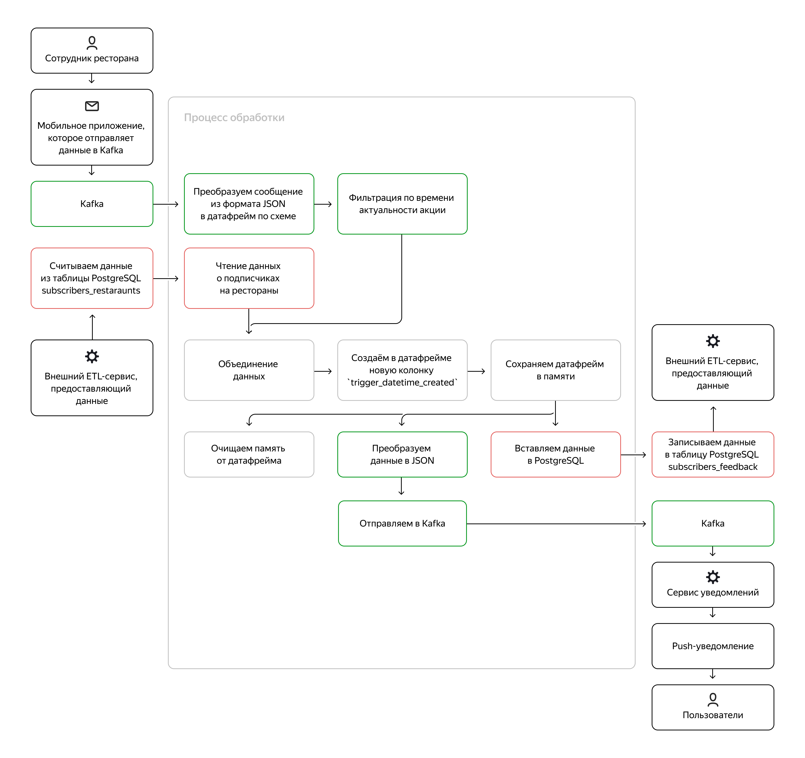

## **Цели проекта**  

- Создать сервис потоковой обработки данных, расширяющий возможности онлайн приложения по доставке еды: обогащение входной информации данными из БД, отправка сообщений в выходной поток

## **Используемые технологии и инструменты**
Kafka  
PySpark  
AirFlow  
kcat  
Airflow  
Jupyter Notebook  
SQL  
PostgreSQL
Spark Streaming

## **Постановка задачи**

1. Реализовать сервис по следующей примерно схеме:



Сервис должен:
- читать данные из Kafka с помощью Spark Structured Streaming и Python в режиме реального времени
- получать список подписчиков из базы данных Postgres
- соединять данные из Kafka с данными из БД
- сохранять в памяти полученные данные
- отправлять выходное сообщение в Kafka с информацией об акции, пользователе со списком избранного и ресторане
- добавлять записи в Postgres, чтобы впоследствии получить фидбэк от пользователя

## **Реализация**

Для разработки и отладки использовался [Python Notebook](src/scripts/project8.ipynb)

Финальный код оформлен в виде модуля на Python, его [код](src/scripts/project8.py) приведен далее.

```python
import os

from datetime import datetime
from pyspark.sql import SparkSession
from pyspark.sql.functions import from_json, to_json, col, lit, struct
from pyspark.sql.types import StructType, StructField, StringType, LongType

kafka_security_options = {
    'kafka.security.protocol': 'SASL_SSL',
    'kafka.sasl.mechanism': 'SCRAM-SHA-512',
    'kafka.sasl.jaas.config': 'org.apache.kafka.common.security.scram.ScramLoginModule required username=\"XXX\" password=\"XXX\";',
}

TOPIC_NAME_OUT = 'student.topic.cohortXX.senigser.out' 
TOPIC_NAME_IN = 'student.topic.cohortXX.senigser.in' 

# метод для записи данных в 2 target: в PostgreSQL для фидбэков и в Kafka для триггеров
def foreach_batch_function(df, epoch_id):

    try:
        # сохраняем df в памяти, чтобы не создавать df заново перед отправкой в Kafka
        df = df.withColumn("trigger_datetime_created", lit(int(round(datetime.utcnow().timestamp())))) 

        df = df.persist()

        # записываем df в PostgreSQL с полем feedback
        
        url = "jdbc:postgresql://localhost:5432/jovyan"
        properties = {
            "driver": "org.postgresql.Driver",
            "user": 'XXX',
            "password": 'XXX'
        }
        table = "public.subscribers_feedback"

        df.selectExpr('restaurant_id', 'adv_campaign_id', 'adv_campaign_content', \
                'adv_campaign_owner', 'adv_campaign_owner_contact', \
                'adv_campaign_datetime_start', 'adv_campaign_datetime_end', \
                'datetime_created', 'client_id', 'trigger_datetime_created', \
                ' \'\' as feedback')\
            .write.jdbc(url=url, table=table, mode="append",
                            properties=properties)
        
        # создаём df для отправки в Kafka. Сериализация в json.
        result = (df.withColumn('value', \
            to_json(\
            struct( col('restaurant_id'), 
                    col('adv_campaign_id'),
                    col('adv_campaign_content'),
                    col('adv_campaign_owner'),
                    col('adv_campaign_owner_contact'),
                    col('adv_campaign_datetime_start'),
                    col('adv_campaign_datetime_end'),
                    col('datetime_created'),
                    col('client_id'),
                    col('trigger_datetime_created')
                    ))
            )).select('value')
        
        # ...
        # отправляем сообщения в результирующий топик Kafka без поля feedback
        out_query = (result
                .write
                .format("kafka")
                .option('kafka.bootstrap.servers', 'XXX.mdb.yandexcloud.net:9091')
                .options(**kafka_security_options)
                .option("topic", TOPIC_NAME_OUT)
                .save())
        
        # очищаем память от df
        df.unpersist()
    
    except Exception as e:
    # Обработка ошибки
        print("An error occurred:", str(e))

# необходимые библиотеки для интеграции Spark с Kafka и PostgreSQL
spark_jars_packages = ",".join(
        [
            "org.apache.spark:spark-sql-kafka-0-10_2.12:3.3.0",
            "org.postgresql:postgresql:42.4.0",
        ]
    )
# создаём spark сессию с необходимыми библиотеками в spark_jars_packages для интеграции с Kafka и PostgreSQL
spark = SparkSession.builder \
    .appName("RestaurantSubscribeStreamingService") \
    .config("spark.sql.session.timeZone", "UTC") \
    .config("spark.jars.packages", spark_jars_packages) \
    .getOrCreate()

try: 
    # читаем из топика Kafka сообщения с акциями от ресторанов
    restaurant_read_stream_df = spark.readStream \
        .format('kafka') \
        .option('kafka.bootstrap.servers', 'XXX.mdb.yandexcloud.net:9091') \
        .option('subscribe', TOPIC_NAME_IN) \
        .options(**kafka_security_options) \
        .load()
    
    # определяем схему входного сообщения для json
    incomming_message_schema = StructType( \
            [StructField("restaurant_id", StringType()), \
            StructField("adv_campaign_id", StringType()),\
            StructField("adv_campaign_content", StringType()),\
            StructField("adv_campaign_owner", StringType()),\
            StructField("adv_campaign_owner_contact", StringType()),
            StructField("adv_campaign_datetime_start", LongType()),\
            StructField("adv_campaign_datetime_end", LongType()),\
            StructField("datetime_created", LongType())\
            ])

    # определяем текущее время в UTC в миллисекундах
    current_timestamp_utc = int(round(datetime.utcnow().timestamp()))

    # десериализуем из value сообщения json и фильтруем по времени старта и окончания акции
    restaurant_read_stream_df = restaurant_read_stream_df \
        .withColumn('value', restaurant_read_stream_df.value.cast(StringType()))\
        .withColumn('values_struct', from_json(col("value"), incomming_message_schema))\
        .select("values_struct.*") 

    filtered_read_stream_df = restaurant_read_stream_df \
        .filter((current_timestamp_utc >= col('adv_campaign_datetime_start')) & \
            (current_timestamp_utc <= col('adv_campaign_datetime_end'))) 

except Exception as e:
    print("An error occurred while reading from Kafka:", str(e))

try:
    # вычитываем всех пользователей с подпиской на рестораны
    subscribers_restaurant_df = spark.read \
        .format('jdbc') \
        .option('url', 'jdbc:postgresql://XXX.mdb.yandexcloud.net:6432/de') \
        .option('driver', 'org.postgresql.Driver') \
        .option('dbtable', 'subscribers_restaurants') \
        .option('user', 'XXX') \
        .option('password', 'XXX') \
        .load()
except Exception as e:
    print("An error occurred while reading from PostgreSQL:", str(e))

try:
    # джойним данные из сообщения Kafka с пользователями подписки по restaurant_id (uuid). Добавляем время создания события.
    result_df = filtered_read_stream_df.join(subscribers_restaurant_df, "restaurant_id", 'inner')
except Exception as e:
    print("An error occurred while joining data from stream and from PostgreSQL:", str(e))

try:
    # запускаем стриминг
    query = result_df.writeStream \
        .foreachBatch(foreach_batch_function) \
        .start() \
        .awaitTermination()
except Exception as e:
    print("An error occurred while streaming:", str(e))
finally:
    # Make closing actions (release resource for example)
    query.stop() 
```